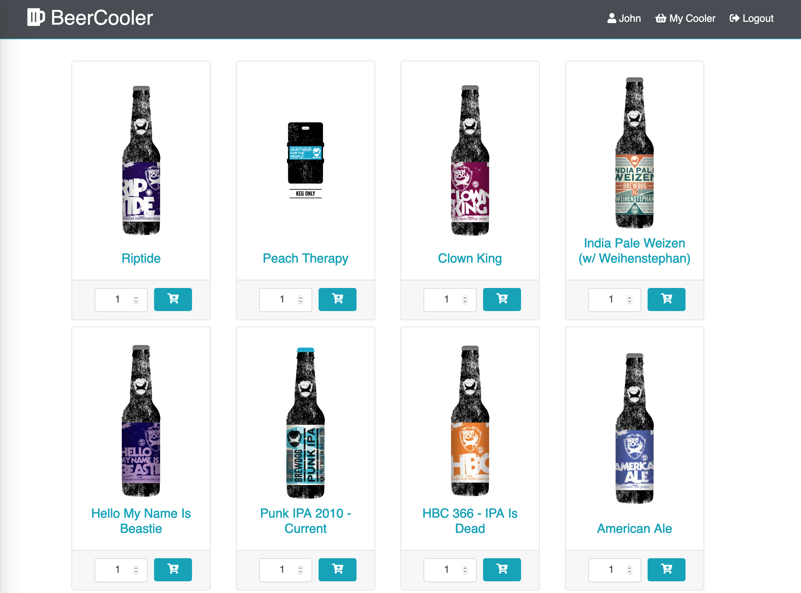
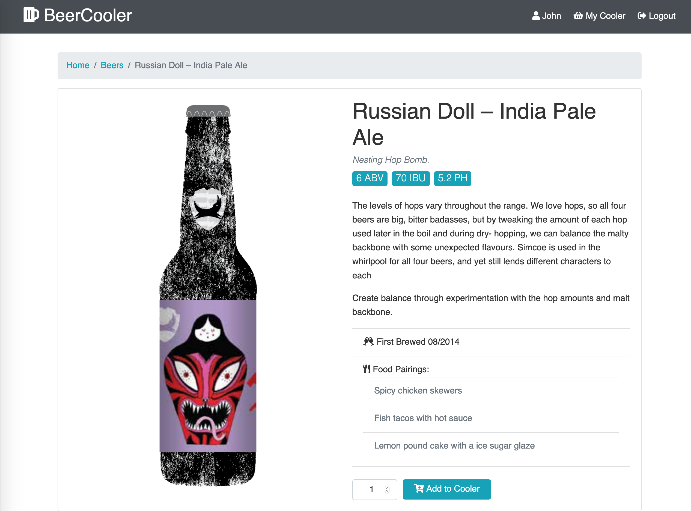
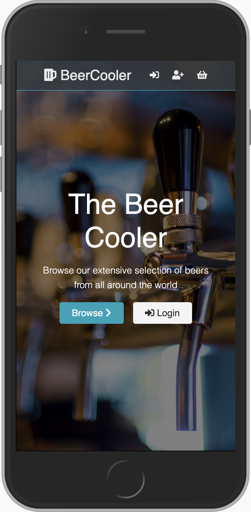
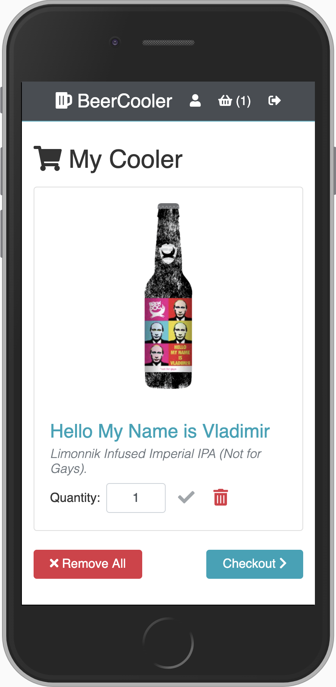

# The BeerCooler

An E-commerce app for beer enthusiasts of all flavors. Built using the [MERN](https://medium.com/@digimktg/what-is-mern-stack-9c867dbad302) stack.






## Features

- User authentication using JSON web tokens.
- Password reset link is emailed to you if you forget your password.
- Add/remove items in a basket (Cooler).
- Checkout as either a user or a guest.
- Successful checkout will generate an order which itemizes the address, payment, and selected items.
- Checkout as guest: no personal information is saved.
- Checkout as user: address, payment, and order history is saved for future accessibility .

## Setup

To clone and run this application, you'll need [Git](https://git-scm.com/) and [Node.js](https://nodejs.org/) (which comes with [npm](https://www.npmjs.com/)) installed on your computer. From your command line:

```sh
# Clone this repository
$ git clone https://github.com/andyrutherford/beer-cooler.git

# Go into the repository
$ cd

# Install dependencies
$ npm install

# Create /config/config.env with the following variables:
$ MONGO_URI=<your-mongoDb-URI>
$ JWT_SECRET=<your-jwt-secret>

# If you want the password reset email to use your own email, also add these variables:
$ EMAIL_SMTP=<your-email-host>
$ EMAIL_USER=<your-email-address>
$ EMAIL_PASSWORD=<your-email-address-password>

# Run the app
$ npm run dev
```

## Tech

The BeerCooler uses a number of open source projects to work properly:

- [ReactJS](https://reactjs.org/) - A JavaScript library for building user interfaces
- [node.js](http://nodejs.org) - evented I/O for the backend
- [Express](http://expressjs.com) - fast node.js network app framework
- [mongoDB](https://www.mongodb.com/) - general purpose, document-based, distributed database
- [React-Redux](https://react-redux.js.org/) - for state management
- [mongoose](https://mongoosejs.com/) - MongoDB object modeling for Node.js
- [JSON Web Token](https://jwt.io/) - for user authentication
- [NodeMailer](https://nodemailer.com/) - module for Node.js to send emails
- [Bootstrap](https://getbootstrap.com/) - for utility classes
- [FontAwesome](https://fontawesome.com/) - for vector icons
- [PUNK API](https://punkapi.com/) - API for [Brewdog's](https://www.brewdog.com/uk/) expansive back catalogue of beer

## Demo

https://beer-cooler-2635.herokuapp.com/

## License

MIT
